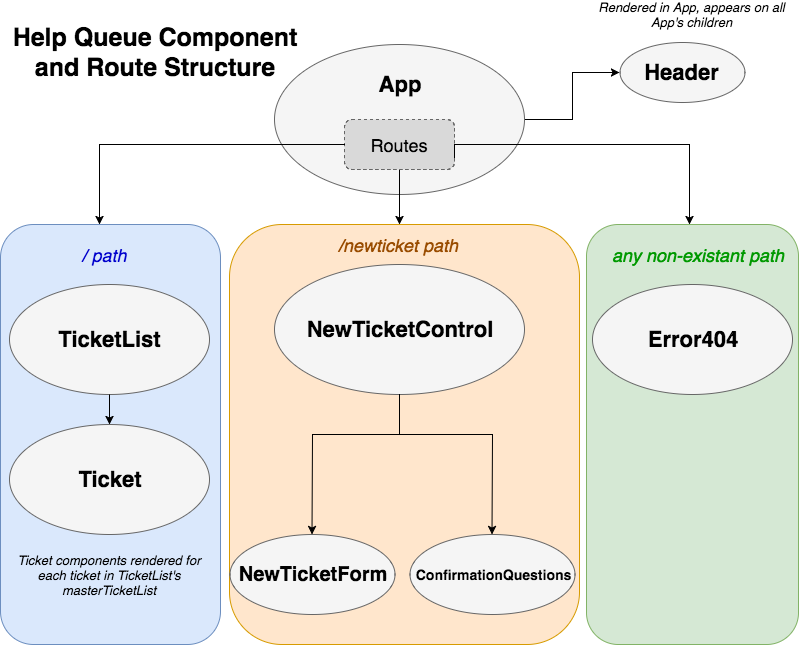

# React Redux Help Queue Ticket Creator
Epicodus Curriculum Lesson to create a help queue ticket generator using React and Redux, with a Firebase backend to save tickets.

**Ginger Lee Kretschmer** - March 7, 2018

### Help Queue Component Tree - before Admin path

### Technologies Used
* React
* Redux
* Webpack
* JSX
* Jest
* Firebase
* ES6
* Bable
